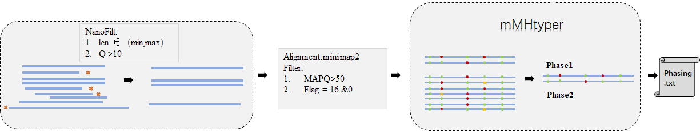

### Overview

&emsp; &emsp; mMHtyper is an end-to-end pipeline for recognizing the multi-SNP microhaplotypes in Nanopore sequencing
data. If you have more than two SNPs to recognize microhaplotypes, you can choose mMHtyper not MHtyper.

### mMHtyper workflow



#### Step1：

&emsp;The raw reads were filtered by [NanoFilt](https://github.com/wdecoster/nanofilt), you can set the Q-value and the
length according to your work.

#### Step2：

&emsp;To get the high-quality alignments, we filtered the ".bam" files by setting the MAPQ>50 and Flag =16 & 0.

#### Step3：

&emsp;**1. The filtered ".bam" files and a bed file were as the input of mMHtyper, the header of bed file as below table.**

|MiniHap name|chromosome|db SNP|Position (GRCh38)|REF|ALT|
|------------|----------|------|-----------------|---|---|

&emsp;MiniHap name: The name of your multi-SNP microhaplotypes.

&emsp;Chromosome: The name of Chromosome.

&emsp;db SNP: The ID of SNP.

&emsp;Position (GRCh38):The positions of SNP in GRCh38.

&emsp;REF: The base of SNP in GRCh38.

&emsp;ALT: The alleles of SNP.


&emsp;**2. The mMHtyper can create the "Phasing.txt", the header of it as below table.**

|chr|pos|REF|sample|db SNP|genotypes|depth|phase1|phase2|
|---|---|---|------|------|---------|-----|------|------|

&emsp;chr: The name of Chromosome.

&emsp;pos: The positions of SNP in GRCh38.

&emsp;REF: The base of SNP in GRCh38.

&emsp;sample: The name of your multi-SNP microhaplotypes.

&emsp;db SNP: The ID of SNP.

&emsp; genotypes: The genotypes of SNP.

&emsp;depth: The depth of SNP, the max depth is 10000.

&emsp;phase1: The haplotype 1 of SNP. 

&emsp;phase2: The haplotype 2 of SNP. 


### Python environment construction and required software installation

```
   conda create -n mMHtyper  
   conda activate mMHtyper 
   conda config --add channels bioconda 
   conda config --add channels
   conda install --yes --file requirements.txt
```

### mMHtyper installation

```
   git clone https://github.com/willow2333/mMHtyper.git
   cd mMHtyper  
   python Scripts/Phasing.py --h
   
   usage: Phasing.py [-h] [--sampledir SAMPLEDIR] [--ref REF] [--bed BED]

    optional arguments:
      -h, --help            show this help message and exit
      --sampledir SAMPLEDIR
                            The absolute path of fastq files, the fastq files need
                            be gzip and named *.fq.gz
      --ref REF             The absolute path of reference file
      --bed BED             The absolute path of bed file
```

### Illustration

#### 1.Test

```
   python Scripts/Phasing.py  --sampledir {path} --ref hg38.fa  --bed XX.bed 
```


© 2023 by Yiping Hou (forensic@scu.edu.cn), Zheng Wang (wangzhengtim@scu.edu.cn), Liu Qin (ql_willow@163.com)

